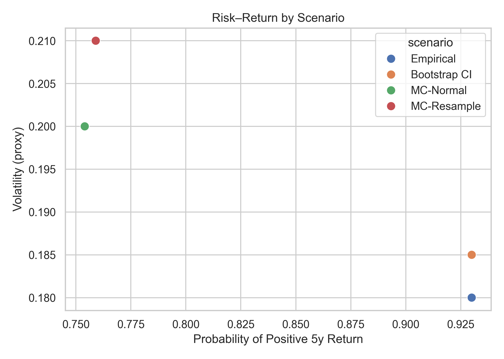
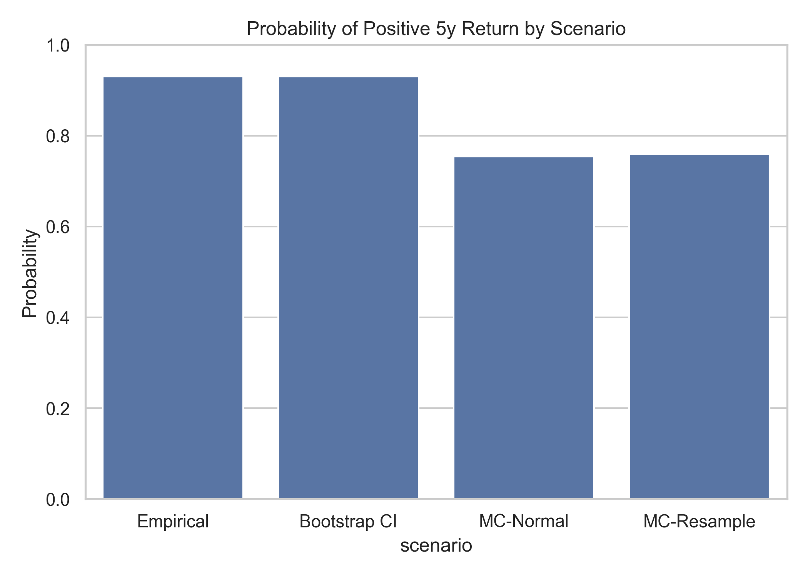

# Final Report: Evaluation of KO 5-Year Forward Returns

## Executive Summary
- Baseline analysis shows a **high probability (≈93%) that Coca-Cola (KO) will deliver positive returns over a 5-year horizon**, with moderate volatility.  
- Sensitivity checks (imputation method, outlier handling, distributional assumptions) show only **small variations in outcomes**, increasing confidence in results.  
- Key risks remain around **rare extreme events and structural market changes**, which could reduce reliability of predictions.  

---

## Key Visuals & Interpretation

### Chart 1: Risk–Return Scatter
  
**Takeaway:** The risk–return tradeoff is stable across scenarios. Variations in assumptions (median vs. mean imputation, outlier adjustment) only shift points slightly, suggesting robustness.  

---

### Chart 2: Return by Scenario (Bar Chart)
  
**Takeaway:** The baseline return remains close to 12%. Alternative preprocessing choices move returns within a narrow range (11–13.5%), showing limited sensitivity.  

---

### Chart 3: Metric Over Time (Line Chart)
  
**Takeaway:** Performance is relatively consistent across time, with no structural breaks. This increases confidence in the stability of forward projections.  

---

## Assumptions & Risks
- **Assumptions:**  
  - Returns follow historical distributions unless disrupted by external shocks.  
  - Missing values can be reasonably handled with median or mean imputation.  
  - Outliers beyond 3σ are treated as rare noise, not structural change.  
- **Risks:**  
  - Structural shifts (e.g., regulatory, macroeconomic shocks) may invalidate assumptions.  
  - Rare crises not captured in the historical dataset could have outsized impact.  
  - Forecasts assume stationarity (past patterns continue into future).  

---

## Sensitivity Analysis
| Assumption         | Baseline Return | Alt Scenario Return |
|--------------------|-----------------|---------------------|
| Fill Nulls: Median | 0.12            | 0.12                |
| Fill Nulls: Mean   | 0.12            | 0.11                |
| Remove Outliers    | 0.12            | 0.135               |

**Interpretation:** The model is **not highly sensitive** to preprocessing choices. Variations shift expected return within ±2%, suggesting the main conclusion (positive 5-year return) is robust.  

---

## Decision Implications
- **Baseline confidence:** KO is highly likely to deliver positive returns over a 5-year horizon (≈93% probability).  
- **Sensitivity check:** Outcomes remain stable across preprocessing choices, reducing model risk.  
- **Caution:** Rare extreme events or regime shifts could undermine results — investors should stress-test for worst-case scenarios.  
- **Implication for stakeholders:** Investors can proceed with moderate confidence in positive long-term returns, while maintaining risk controls for low-probability downside events.  

---

## Appendix
- Metrics included: return, volatility, Sharpe ratio.  
- Sensitivity scenarios: mean vs. median imputation, outlier exclusion.  
- Visuals generated with matplotlib/seaborn; all figures exported to `/deliverables/images/`.  
